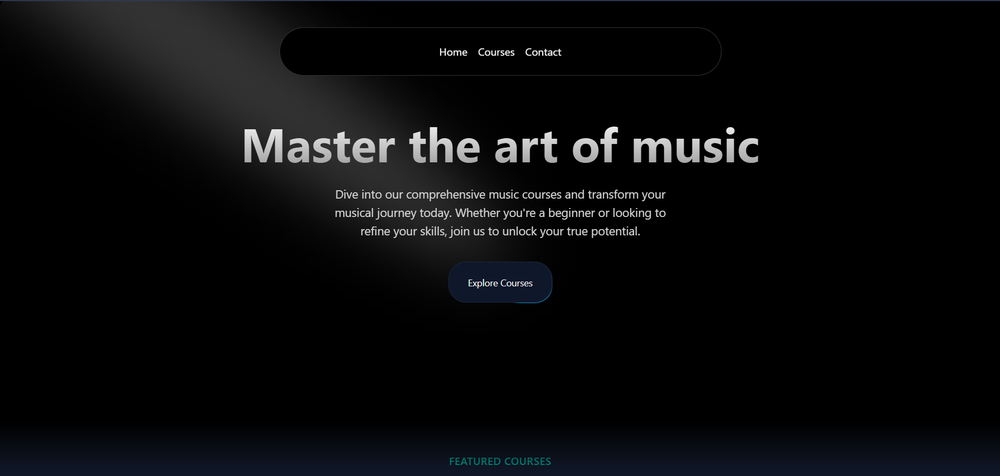

# Musical Website

Built with ❤️ for community 

  
  

> This is  a frontend project

## Why I built 
I was not actually felling confident in using libraries like shadcn and other so practice it and made this.

### Tech Stack
- TypeScript
- Nextjs
- Tailwind CSS
- Aceternity UI

## Made with ❤️ by Ahmad Siddique 